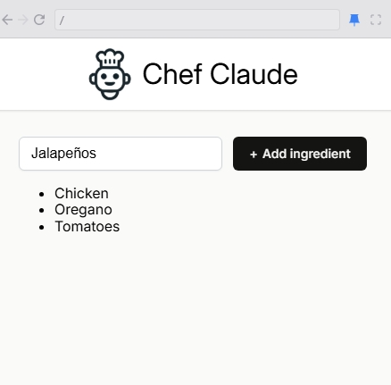

# State
Let's say you have an app:



Your course of action here is to have a `js` array and get the data on the `input`, `.push()` it on the array, and then do:

```jsx
export default function Main() {
    const ingredients = ["Chicken", "Oregano", "Tomatoes"]
    
    const ingredientsListItems = ingredients.map(ingredient => (
        <li key={ingredient}>{ingredient}</li>
    ))
```

However, that won't work, what you will need to do is use a `state`

## Props vs State
- **Props** refers to the properties being passed into a component (like arguments in a funtion, we know that components are just functions)
- You are not allowed to modify the property being passed on, it's like modifying the arguments that the user has passed on to your function
- **State** refers to the values that are _managed_ by the component. 
- Similar to variables declared _inside_ a function
- You probably want a star if you have a valies that should be saced/displayed (changing value)

## View as a function of State
1. Render
- The function will only run again if:
    - it receives a new props from above 
    - its internal state values change
2. setState
- Changing a local variable does not cause the rendering 
- Changing the `state` with a built in function `setState` does
3. `view` = function(state)
- Thus when state changes and react re-runs your component, something new gets returned and replaces what used to be on the page

> The function of the `state` is like a light bulb. If you changed the switch (turned on) the view will be different, the room will be illuminated, otherwise it will be dark, so the view will be automatic

Here is the `setState` in action:
```jsx
export default function App() {
    let state = "Yes"
    
    function handleClick() {
        state = "Heck yes"
    }
    
    return (
        <main>
            <h1 className="title">Is state important to know?</h1>
            <button onClick={handleClick} className="value">{state}</button>
        </main>
    )
}
```
> Simply changing a local variable won't run the function again
## State in the Wild
So we will need to use the `state`:
```jsx
import { useState } from "react"

const result = React.useState()
console.log(result)
```
What you will get here is:
- `[undefined, f()]` so it's an array and a function

To not get an `undefined` and have an initial _state_, what you can do instead is:
```jsx
import React from "react"

export default function App() {
    const result = React.useState("Yes")
    console.log(result)
    
    return (
        <main>
            <h1 className="title">Is state important to know?</h1>
            <button className="value">{result[0]}</button>
        </main>
    )
}
```
## `useState` array destructuring
Simply assigning state like in the above, is not much informative, instead what you can do is do an `destructring`:

`const [myStateVar, func] = React.useState('whateva')`

Or if it's an object you are returning, you can do:

`const {myObj, func} = React.useState(...)`

or

```jsx
const [state, setState] = React.useState({
    num1: 1,
    num2: 1,
    response: "",
    score: 0
});
```

## Changing State
- Apparently, the `func` that you get from using the `useState` is the one used to change the state.
- **You can't simply change a state by assigning something to it**
```jsx
import React from "react"

export default function App() {
    let [isImportant, setIsImportant] = React.useState("Yes")
    setIsImportant("Heck yes!")
    
    return (
        <main>
            <h1 className="title">Is state important to know?</h1>
            <button className="value">{isImportant}</button>
        </main>
    )
}
```
## Changing state Loop
The above code however, will set an error, because you are infinitely rendering the function with the `setIsImportant`.
- What you can do is:
```jsx
import React from "react"

export default function App() {
    let [isImportant, setIsImportant] = React.useState("Yes")
    
    function handleClick() {
        setIsImportant("Heck yes")
    }
    
    return (
        <main>
            <h1 className="title">Is state important to know?</h1>
            <button onClick={handleClick} className="value">{isImportant}</button>
        </main>
    )
}
```
## Modifying React State without UseState:
```javascript
    function add() {
        setCount(count = count + 1)
    }    
```
This is a **no no**!

## Callback Functions in State Updates
Let's say you have this:
```jsx
export default function App() {
    const [count, setCount] = React.useState(0)

    function add() {
        setCount(count + 1)
    }

    function subtract() {
        setCount(count - 1)
    }
}
```
At first glance, this seems fine. But React updates state asynchronously, meaning multiple updates can happen at once and your count value may become outdated.

- If your new state depends on the previous state, you should use the callback form:

```jsx
function add() {
    setCount(function(prevCount) {
        return prevCount + 1
    })
}
```
- Why? Because React guarantees that the prevCount argument passed to the callback will always be the most up-to-date value of state, even when updates are batched.
### Example of the issue
```jsx
subtract()
subtract()
```
- With setCount(count - 1): both calls might see the same count value, leading to only one decrement.
- With the callback function: the second call sees the updated state from the first call, so it decrements correctly.

### Rule of Thumb
- Use the callback form `(setCount(prev => ...))` whenever your next state relies on the previous state.
- Use the direct form `(setCount(value))` when your next state is independent of the current state.
```jsx
  /**
     * Note: if you ever need the old value of state
     * to help you determine the new value of state,
     * you should pass a callback function to your
     * state setter function instead of using
     * state directly. This callback function will
     * receive the old value of state as its parameter,
     * which you can then use to determine your new
     * value of state.
     */
```
### Why we use a callback function
1. You have 2 options for what you can pass in to a
   state setter function (e.g. `setCount`). What are they?
   1. Pass the new version of state that we want to use as the 
      replacement for the old version of state.
   2. Pass a callback function. Must return what we want the new
      value of state to be. Will receive the old version of state
      as a parameter so we can use it to help determine what we want 
      the new value of state to be.


2. When would you want to pass the first option (from answer
   above) to the state setter function?
   
   Whenever we don't really care about (or need) the old value,
   we simply want to set a new value.


3. When would you want to pass the second option (from answer
   above) to the state setter function?

   Whenever we do care about the previous value in state and need
   it to help us determine what the new value should be.

### Example:
```jsx
export default function App() {
    const [count, setCount] = React.useState(0)

    function addFive() {
        // WRONG: This will only add 1, not 5
        for (let i = 0; i < 5; i++) {
            setCount(count + 1)
        }
    }

    function addFiveCorrect() {
        // CORRECT: Each update is based on the latest value
        for (let i = 0; i < 5; i++) {
            setCount(prevCount => prevCount + 1)
        }
    }

    return (
        <div>
            <h1>{count}</h1>
            <button onClick={addFive}>Add 5 (Wrong)</button>
            <button onClick={addFiveCorrect}>Add 5 (Correct)</button>
        </div>
    )
}
```
### What happens here
- Without the callback form (setCount(count + 1)):
Each loop iteration sees the same count value (stale), so you only get +1 total.
- With the callback form (setCount(prev => prev + 1)):
Each iteration uses the updated value, so you get the correct +5 total.