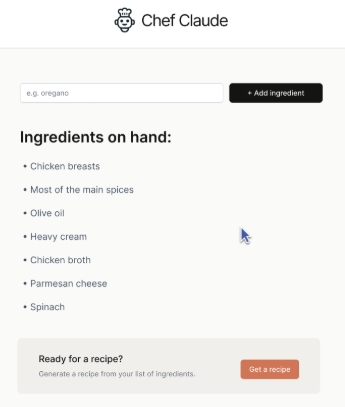

# Conditional Rendering

- Conditional rendering is simply like the image above, you only want to add the "Get recipe" **if** ingredients are added.

1. Using `&&`
- You can take advantage of the `JS`'s way of utilizing `&&` to do conditional rendering.
In `js`, you can do something like this:
```js
if (false && console.log("This is a running code")){
    ...
}
```
>
It will print nothing becuase it has already evaluated the `false` and realize that whatever comes after the `&&` should not run because the first expression is false. 

**But** if you do:
```js
if (true && console.log("This is a running code")){
    ...
}
```
> This is a running code
It will run because the first expression is `true`

So you can do something like:
```jsx
return (
    <div>
        {props.setup && <h3>{props.setup}</h3>}
        {isShown && <p>{props.punchline}</p>}
        <button onClick={toggleShown}>Show punchline</button>
        <hr />
    </div>
)
```
Another example:
```jsx
export default function App() {
    const [unreadMessages, setUnreadMessages] = React.useState(["a", "b"])
    
    return (
        <div>
            {
                unreadMessages.length > 0 && 
                <h1>You have {unreadMessages.length} unread messages!</h1>
            }
            
        </div>
    )
}
```
2. Ternary
There could be a bug with `&&` because if the expression evaluates to `0`, it will print `0`. To avoid that you can do:

`{isShown ? <p>{props.punchline}</p> : null}`

## Key points:
2. When would you use &&?
When you want to either display something or NOT display something. Just be explicit (make sure that this evaluates to `true` or `false`)


3. When would you use a ternary?
When you need to decide which of 2 things to display

4. What if you need to decide between > 2 options on
   what to display?
if...else if...else conditional or maybe a `switch` statement.